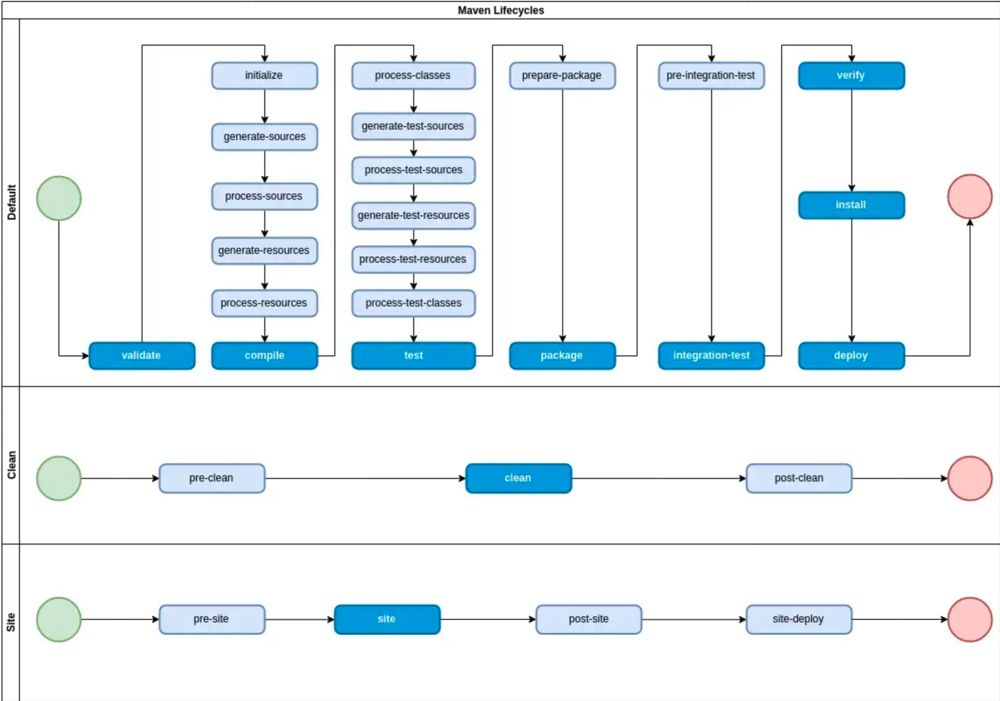
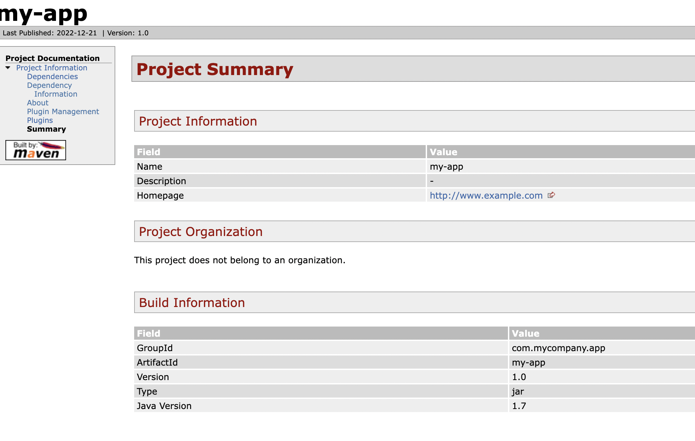

# Example Java Maven Library: Part 1

The purpose of this project is to be a basic Java library that is built using Maven, with the additional intention of adding to it common software utilities step-by-step.

Prerequisites

- Git Setup: https://github.com/jvalentino/setup-git
- Building Java 101: https://github.com/jvalentino/java-building-101

# (1) Maven 101



- https://medium.com/@yetanothersoftwareengineer/maven-lifecycle-phases-plugins-and-goals-25d8e33fa22

# (2) Building It

```bash
$ ./mvnw package
[INFO] Scanning for projects...
[INFO] 
[INFO] ----------------------< com.mycompany.app:my-app >----------------------
[INFO] Building my-app 1.0
[INFO] --------------------------------[ jar ]---------------------------------
[INFO] 
[INFO] --- maven-resources-plugin:3.0.2:resources (default-resources) @ my-app ---
[INFO] Using 'UTF-8' encoding to copy filtered resources.
[INFO] skip non existing resourceDirectory /Users/john.valentino/workspaces/personal/example-java-maven-lib-1/src/main/resources
[INFO] 
[INFO] --- maven-compiler-plugin:3.8.0:compile (default-compile) @ my-app ---
[INFO] Nothing to compile - all classes are up to date
[INFO] 
[INFO] --- maven-resources-plugin:3.0.2:testResources (default-testResources) @ my-app ---
[INFO] Using 'UTF-8' encoding to copy filtered resources.
[INFO] skip non existing resourceDirectory /Users/john.valentino/workspaces/personal/example-java-maven-lib-1/src/test/resources
[INFO] 
[INFO] --- maven-compiler-plugin:3.8.0:testCompile (default-testCompile) @ my-app ---
[INFO] Nothing to compile - all classes are up to date
[INFO] 
[INFO] --- maven-surefire-plugin:2.22.1:test (default-test) @ my-app ---
[INFO] 
[INFO] -------------------------------------------------------
[INFO]  T E S T S
[INFO] -------------------------------------------------------
[INFO] Running com.mycompany.app.AppTest
[INFO] Tests run: 1, Failures: 0, Errors: 0, Skipped: 0, Time elapsed: 0.014 s - in com.mycompany.app.AppTest
[INFO] 
[INFO] Results:
[INFO] 
[INFO] Tests run: 1, Failures: 0, Errors: 0, Skipped: 0
[INFO] 
[INFO] 
[INFO] --- maven-jar-plugin:3.0.2:jar (default-jar) @ my-app ---
[INFO] ------------------------------------------------------------------------
[INFO] BUILD SUCCESS
[INFO] ------------------------------------------------------------------------
[INFO] Total time:  1.012 s
[INFO] Finished at: 2022-12-15T18:49:39-06:00
[INFO] ------------------------------------------------------------------------
```

Specifically, you get this output:

# (3) Wait, how does all this work?

Maven.

## pom.xml

```xml
<?xml version="1.0" encoding="UTF-8"?>

<project xmlns="http://maven.apache.org/POM/4.0.0" xmlns:xsi="http://www.w3.org/2001/XMLSchema-instance"
  xsi:schemaLocation="http://maven.apache.org/POM/4.0.0 http://maven.apache.org/xsd/maven-4.0.0.xsd">
  <modelVersion>4.0.0</modelVersion>

  <groupId>com.mycompany.app</groupId>
  <artifactId>my-app</artifactId>
  <version>1.0</version>

  <name>my-app</name>
  <!-- FIXME change it to the project's website -->
  <url>http://www.example.com</url>

  <properties>
    <project.build.sourceEncoding>UTF-8</project.build.sourceEncoding>
    <maven.compiler.source>1.7</maven.compiler.source>
    <maven.compiler.target>1.7</maven.compiler.target>
  </properties>

  <dependencies>
    <dependency>
      <groupId>junit</groupId>
      <artifactId>junit</artifactId>
      <version>4.11</version>
      <scope>test</scope>
    </dependency>
  </dependencies>

  <build>
    <pluginManagement><!-- lock down plugins versions to avoid using Maven defaults (may be moved to parent pom) -->
      <plugins>
        <!-- clean lifecycle, see https://maven.apache.org/ref/current/maven-core/lifecycles.html#clean_Lifecycle -->
        <plugin>
          <artifactId>maven-clean-plugin</artifactId>
          <version>3.1.0</version>
        </plugin>
        <!-- default lifecycle, jar packaging: see https://maven.apache.org/ref/current/maven-core/default-bindings.html#Plugin_bindings_for_jar_packaging -->
        <plugin>
          <artifactId>maven-resources-plugin</artifactId>
          <version>3.0.2</version>
        </plugin>
        <plugin>
          <artifactId>maven-compiler-plugin</artifactId>
          <version>3.8.0</version>
        </plugin>
        <plugin>
          <artifactId>maven-surefire-plugin</artifactId>
          <version>2.22.1</version>
        </plugin>
        <plugin>
          <artifactId>maven-jar-plugin</artifactId>
          <version>3.0.2</version>
        </plugin>
        <plugin>
          <artifactId>maven-install-plugin</artifactId>
          <version>2.5.2</version>
        </plugin>
        <plugin>
          <artifactId>maven-deploy-plugin</artifactId>
          <version>2.8.2</version>
        </plugin>
        <!-- site lifecycle, see https://maven.apache.org/ref/current/maven-core/lifecycles.html#site_Lifecycle -->
        <plugin>
          <artifactId>maven-site-plugin</artifactId>
          <version>3.7.1</version>
        </plugin>
        <plugin>
          <artifactId>maven-project-info-reports-plugin</artifactId>
          <version>3.0.0</version>
        </plugin>
      </plugins>
    </pluginManagement>
  </build>
</project>
```


# (4) Site

```bash
~/workspaces/personal/example-java-maven-lib-1 $ ./mvnw clean site
[INFO] Scanning for projects...
[INFO] 
[INFO] ----------------------< com.mycompany.app:my-app >----------------------
[INFO] Building my-app 1.0
[INFO] --------------------------------[ jar ]---------------------------------
[INFO] 
[INFO] --- maven-clean-plugin:3.1.0:clean (default-clean) @ my-app ---
[INFO] Deleting /Users/john.valentino/workspaces/personal/example-java-maven-lib-1/target
[INFO] 
[INFO] --- maven-site-plugin:3.7.1:site (default-site) @ my-app ---
[INFO] configuring report plugin org.apache.maven.plugins:maven-project-info-reports-plugin:3.0.0
[INFO] 15 reports detected for maven-project-info-reports-plugin:3.0.0: ci-management, dependencies, dependency-info, dependency-management, distribution-management, index, issue-management, licenses, mailing-lists, modules, plugin-management, plugins, scm, summary, team
[INFO] Rendering site with default locale English (en)
[INFO] Relativizing decoration links with respect to localized project URL: http://www.example.com
[INFO] Rendering content with org.apache.maven.skins:maven-default-skin:jar:1.2 skin.
[INFO] Generating "Dependencies" report  --- maven-project-info-reports-plugin:3.0.0:dependencies
[INFO] Generating "Dependency Information" report --- maven-project-info-reports-plugin:3.0.0:dependency-info
[INFO] Generating "About" report         --- maven-project-info-reports-plugin:3.0.0:index
[INFO] Generating "Plugin Management" report --- maven-project-info-reports-plugin:3.0.0:plugin-management
[INFO] Generating "Plugins" report       --- maven-project-info-reports-plugin:3.0.0:plugins
[INFO] Generating "Summary" report       --- maven-project-info-reports-plugin:3.0.0:summary
[INFO] ------------------------------------------------------------------------
[INFO] BUILD SUCCESS
[INFO] ------------------------------------------------------------------------
[INFO] Total time:  1.238 s
[INFO] Finished at: 2022-12-21T10:00:43-06:00
[INFO] ------------------------------------------------------------------------
```



# FAQ


## How did I generate this project?

```bash
$ mvn archetype:generate -DgroupId=com.mycompany.app -DartifactId=my-app -DarchetypeArtifactId=maven-archetype-quickstart -DarchetypeVersion=1.4 -DinteractiveMode=false

[INFO] ----------------------------------------------------------------------------
[INFO] Using following parameters for creating project from Archetype: maven-archetype-quickstart:1.4
[INFO] ----------------------------------------------------------------------------
[INFO] Parameter: groupId, Value: com.mycompany.app
[INFO] Parameter: artifactId, Value: my-app
[INFO] Parameter: version, Value: 1.0
[INFO] Parameter: package, Value: com.mycompany.app
[INFO] Parameter: packageInPathFormat, Value: com/mycompany/app
[INFO] Parameter: package, Value: com.mycompany.app
[INFO] Parameter: groupId, Value: com.mycompany.app
[INFO] Parameter: artifactId, Value: my-app
[INFO] Parameter: version, Value: 1.0
[INFO] Project created from Archetype in dir: /Users/john.valentino/workspaces/personal/example-java-maven-lib-1/my-app
[INFO] ------------------------------------------------------------------------
[INFO] BUILD SUCCESS
[INFO] ------------------------------------------------------------------------
[INFO] Total time:  57.565 s
[INFO] Finished at: 2022-12-15T18:44:41-06:00
[INFO] ------------------------------------------------------------------------
```

## How did I generate the Maven wrapper?

```bash
mvn wrapper:wrapper
```


